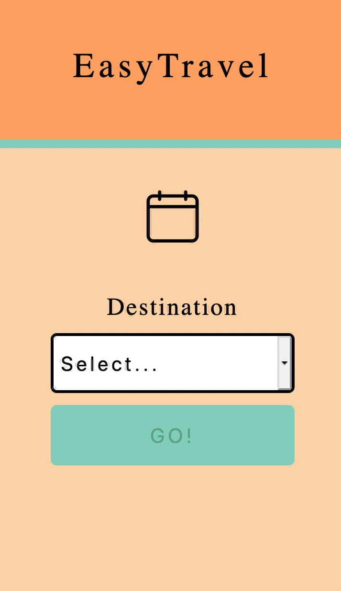
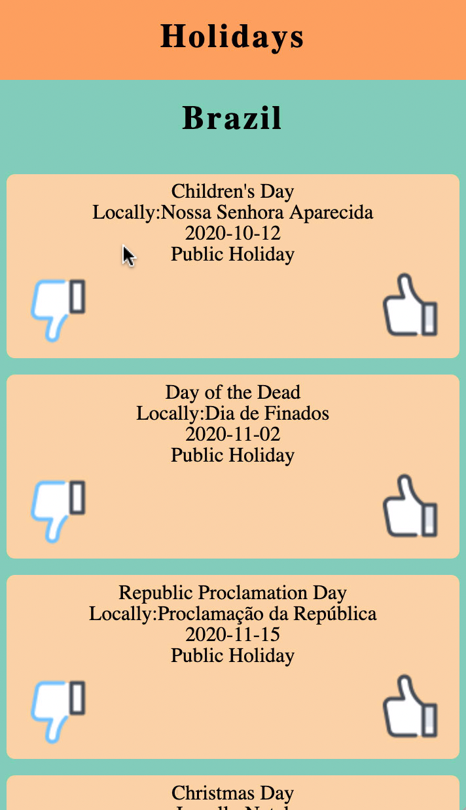
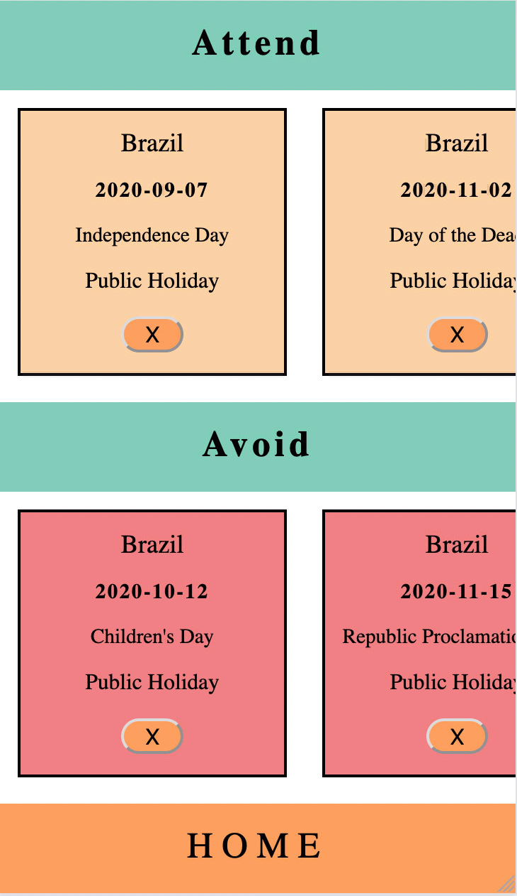

# EasyTravel 

### Abstract
Final solo project Module 3. I was tasked with building an application in 6 days that would display dynamic use of React, React Hooks, React Router, React Testing Library + Jest. Easy Travel is an application that allows a user to search through international Holidays to ease travel planning. A user can select if the holiday is one they would like to Attend or one to Avoid depending if the user is trying to avoid crowds or would like to experience cultural immersion. 

This project was bootstrapped with [Create React App](https://github.com/facebook/create-react-app).

This project was tested with React Testing Library + Jest. 

## Images

### Installation instructions:

### `clone repository in your terminal`

then in your terminal, run:

### `npm install`
### `npm run start`

Runs the app in the development mode. 
Open [http://localhost:3000](http://localhost:3000) to view it in the browser.
